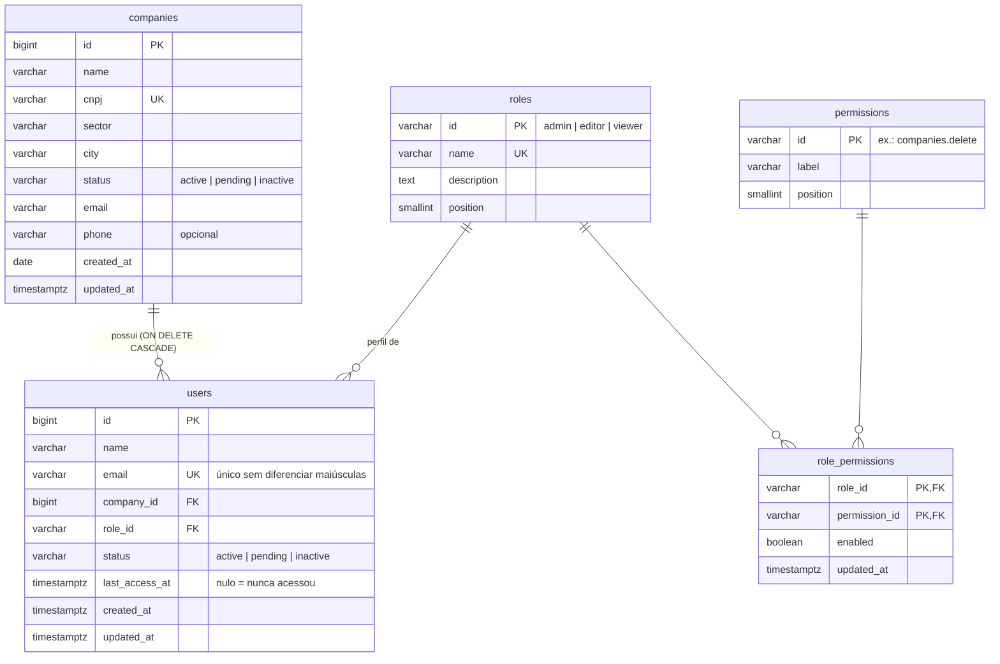

# Backend — Gerenciador de Empresas

API REST em **Flask** com **PostgreSQL** (via `psycopg` e pool de conexões) que atende o frontend em `../frontend`.

## Pré-requisitos

- **Python 3.11+**
- **PostgreSQL 16** — local ou pelo Docker Compose deste projeto
- **make** (opcional; os comandos equivalentes estão abaixo)

## Configuração

Copie o exemplo de variáveis de ambiente, se o `.env` ainda não existir, e ajuste usuário e senha do banco:

```bash
cd backend
cp .env.example .env
```

| Variável | Uso |
| --- | --- |
| `POSTGRES_USER`, `POSTGRES_PASSWORD`, `POSTGRES_DB`, `POSTGRES_HOST`, `POSTGRES_PORT` | Conexão com o banco (padrão `localhost:5432`). |
| `DATABASE_URL` | Opcional; string de conexão completa, tem prioridade sobre as variáveis acima. |
| `CORS_ORIGINS` | Origens liberadas para o frontend, separadas por vírgula (padrão `*`). |
| `FLASK_DEBUG` | `1` recarrega o servidor ao salvar arquivos. |
| `TEST_DATABASE_URL` | Opcional; banco usado pelos testes (padrão: `<POSTGRES_DB>_test`). |

## Executando

### Opção 1 — tudo pelo Docker

```bash
make up          # ou: docker compose --env-file .env -f docs/docker/docker-compose.yml up --build
```

Sobe o PostgreSQL e a API em <http://localhost:5000>. Na inicialização, a API aplica o esquema e insere os dados de exemplo (apenas se o banco estiver vazio).

### Opção 2 — API local

```bash
make venv install     # cria .venv e instala requirements-dev.txt
make db-up            # opcional: sobe só o PostgreSQL pelo Docker
make db-migrate       # cria as tabelas e os perfis/permissões padrão
make db-seed          # insere as 6 empresas e 6 usuários fictícios
make run-backend-local
```

Sem `make`, use `.venv/bin/python -m scripts.database.migrate`, `... -m scripts.database.seed` e `.venv/bin/python run.py` (no Windows, `.venv\Scripts\python.exe`).

Para apagar tudo e voltar aos dados de exemplo: `make db-reset`.

Depois, confira: `curl http://localhost:5000/api/health` → `{"status": "ok", "database": "ok"}`.

## Testes

Os testes usam um banco separado (`gerenciador_empresas_test` por padrão), recriado antes de cada teste. Crie-o uma vez e rode:

```bash
createdb -h localhost -U postgres gerenciador_empresas_test   # ou CREATE DATABASE pelo psql
make test-backend                                              # ou: .venv/bin/python -m pytest
```

Se o banco de testes não estiver acessível, os testes são ignorados (`skipped`) com a explicação.

## Banco de dados

O esquema está em [`database/schema.sql`](./database/schema.sql) e é idempotente (pode ser aplicado várias vezes).



Decisões principais:

- **Situação** (`status`) com `CHECK` nos três valores usados pelas telas.
- **Usuário pertence a uma empresa**; excluir a empresa exclui seus usuários (`ON DELETE CASCADE`), como a tela de Empresas já descrevia.
- **CNPJ único** por empresa e **e-mail único** por usuário (sem diferenciar maiúsculas). Violações voltam como `409` com a mensagem no campo.
- **Perfis e permissões** são tabelas de referência com ids estáveis (`admin`, `companies.delete`...); os rótulos em português ficam no banco e no frontend. A matriz é a tabela `role_permissions`.
- **Data de cadastro** da empresa é definida pelo banco (`CURRENT_DATE`) e não muda na edição; o **último acesso** do usuário também não é alterado pelo cadastro (ainda não existe login).

## API

Todas as rotas ficam sob `/api` e trocam JSON. Os erros seguem o formato `{"error": "<código>", "message": "<mensagem>", "fields": {"<campo>": "<mensagem>"}}`.

| Método | Rota | Descrição |
| --- | --- | --- |
| `GET` | `/api/health` | Verifica a API e a conexão com o banco |
| `GET` | `/api/companies` | Lista empresas (ordem de cadastro) |
| `POST` | `/api/companies` | Cadastra empresa → `201` |
| `GET` | `/api/companies/<id>` | Detalha empresa |
| `PUT` | `/api/companies/<id>` | Atualiza empresa (mantém id e data de cadastro) |
| `DELETE` | `/api/companies/<id>` | Exclui empresa e seus usuários → `204` |
| `GET` | `/api/users` | Lista usuários |
| `POST` | `/api/users` | Cadastra usuário → `201` |
| `GET` | `/api/users/<id>` | Detalha usuário |
| `PUT` | `/api/users/<id>` | Atualiza usuário (mantém id e último acesso) |
| `DELETE` | `/api/users/<id>` | Exclui usuário → `204` |
| `GET` | `/api/permissions` | Perfis, funcionalidades e matriz `{permissão: {perfil: bool}}` |
| `PUT` | `/api/permissions/<permissão>/roles/<perfil>` | Define `{"enabled": true\|false}` para uma célula |

Exemplo de empresa:

```json
{
  "id": 1,
  "name": "Aurora Tecnologia",
  "cnpj": "00.000.000/0001-01",
  "sector": "Tecnologia",
  "city": "São Paulo / SP",
  "status": "active",
  "email": "contato@aurora.exemplo",
  "phone": "(11) 0000-0001",
  "createdAt": "2026-01-12"
}
```

Exemplo de usuário (campos enviados no `POST`/`PUT`: `name`, `email`, `companyId`, `role`, `status`):

```json
{
  "id": 3,
  "name": "Beatriz Souza",
  "email": "beatriz.souza@nortelogistica.exemplo",
  "companyId": 3,
  "role": "viewer",
  "status": "pending",
  "lastAccess": null
}
```

| Status | Quando |
| --- | --- |
| `400` | Corpo ausente ou que não é um objeto JSON |
| `404` | Empresa, usuário, perfil ou funcionalidade inexistente |
| `409` | CNPJ ou e-mail já cadastrado |
| `422` | Campos inválidos (obrigatórios, e-mail, situação, empresa ou perfil inexistente) |
| `503` | Banco de dados indisponível |

## Estrutura

```
backend/
├── app/
│   ├── config/            # variáveis de ambiente, settings e CORS
│   ├── infrastructure/
│   │   └── database/      # pool de conexões, conexão e transação
│   ├── modules/
│   │   ├── companies/     # routes → controllers → services → repositories (+ schemas)
│   │   ├── users/
│   │   └── permissions/
│   ├── shared/            # erros da API e validação de payloads
│   └── main.py            # create_app()
├── database/schema.sql    # esquema e dados de referência
├── scripts/database/      # migrate, seed e reset
├── tests/                 # testes de integração (pytest + PostgreSQL)
└── run.py
```

Cada módulo segue o modelo em `scripts/cli/templates/module`: `routes` registra as URLs, `controllers` lê a requisição e monta a resposta, `services` aplica as regras e abre a transação, `repositories` executa o SQL e `schemas` valida a entrada e serializa a saída.
